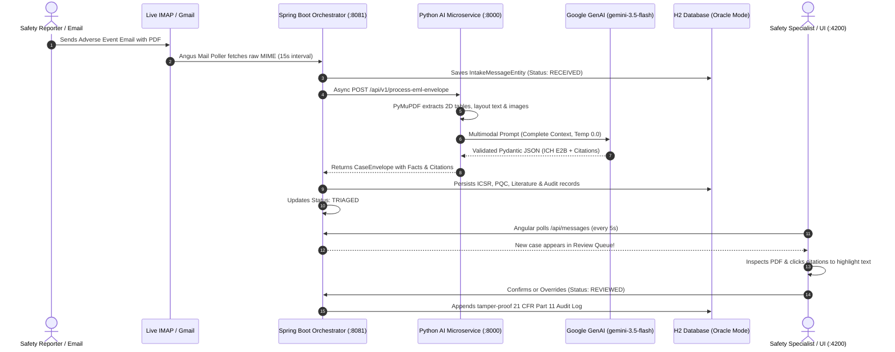
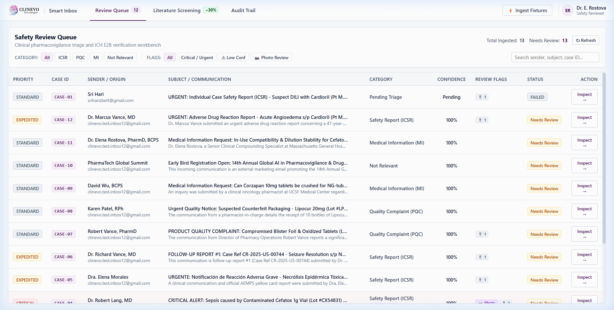
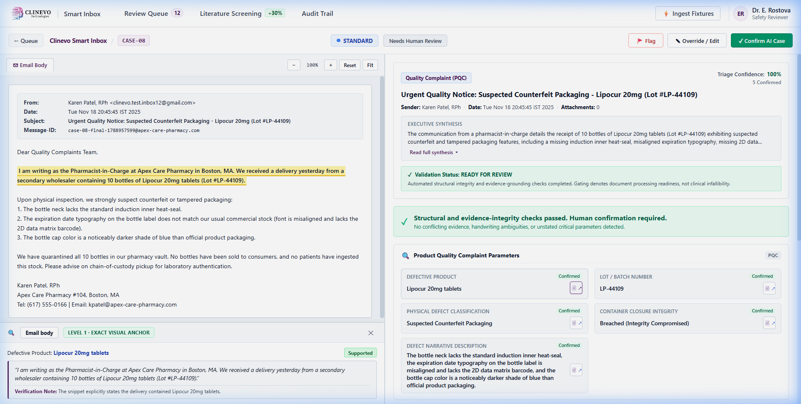
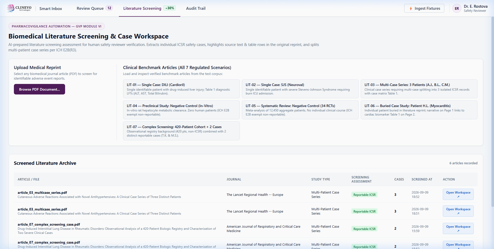
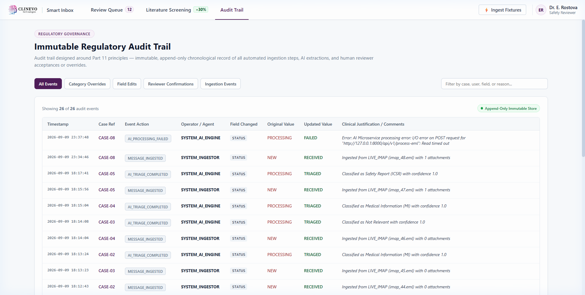

# Clinevo Smart Inbox Assistant for Pharmacovigilance

> **Enterprise-grade, AI-powered pharmacovigilance intake automation platform with human-in-the-loop review.**  
> Built for the Clinevo Technologies Live Project Assignment (Forward Deployment / GenAI Integration Engineer).  
> 📄 **Canonical Evaluator Write-Up (2–5 pages)**: [docs/CLINEVO_WRITEUP.md](file:///c:/projects/SmartInbox/docs/CLINEVO_WRITEUP.md)

---

## 1. Problem Statement

Pharmaceutical companies receive hundreds of unstructured communications daily across shared safety mailboxes—including spontaneous adverse event reports from physicians and patients, product quality complaints from pharmacists, and medical inquiries. Traditionally, pharmacovigilance intake specialists manually read every email and attached PDF, sort messages into regulatory categories, extract clinical safety facts conforming to ICH E2B(R3) guidelines, and transcribe data into safety databases (e.g., Oracle Argus Safety, ArisGlobal LifeSphere).

This manual process is slow, expensive, and error-prone, creating serious compliance risks against strict regulatory expedited reporting deadlines (e.g. 7 or 15 calendar days).

The **Clinevo Smart Inbox Assistant** automates the initial intake and triage pass:
1. Ingests incoming emails and PDF attachments (Digital Forms, Scanned/Handwritten, Literature, Non-English).
2. Performs multi-label regulatory classification (**Safety Report / ICSR**, **Quality Complaint / PQC**, **Medical Information / MI**, and **Not Relevant**).
3. Extracts ICH E2B(R3) clinical entities with strict source-page citations and a zero-hallucination `"Not stated"` policy.
4. Identifies physical defect photographs (vial particulate, damaged packaging) and flags them for immediate human review.
5. Screens scientific literature articles and splits multi-patient case series into independent ICSR records (**+30% Bonus**).
6. Surfaces processed cases on an interactive Angular split-view reviewer dashboard backed by an immutable 21 CFR Part 11 audit trail.

---

## 2. Key Capabilities

- **Unified Intake Engine**: Ingests communications from live IMAP mailboxes (e.g., Gmail / Exchange) or local synthetic fixture files (`.eml` corpus) with identical downstream processing.
- **4 PDF Flavor Processing**:
  - *Digital Forms*: Layout-aware extraction preserving key-value grids and structured markdown tables.
  - *Scanned / Handwritten*: Multimodal vision transcription with calibrated handwriting uncertainty scores.
  - *Published Literature*: Identifies reportable patient cases and filters out non-reportable studies (animal studies, meta-analyses).
  - *Non-English*: Spanish (AEMPS) and German (BfArM) detection with English translation and original-language source linking.
- **Zero-Hallucination Extraction**: If a field (e.g., daily dose frequency, weight) is not explicitly present in the source, it is strictly assigned `"Not stated"`. Unsupported guessing is prohibited.
- **Mandatory Source Attribution**: Every extracted entity links to its exact source (`source_type`, `page_or_location`, and `verbatim_snippet`).
- **Literature Multi-Case Splitting (+30% Bonus)**: Automatically disaggregates multi-patient case series (e.g., 1 article reporting 3 patients) into 3 independent, discrete ICSR records.
- **Human-in-the-Loop Review**: Split-screen dashboard allowing medical reviewers to inspect documents side-by-side with editable AI extractions, accept cases, or override classifications with mandatory audit logging.

---

## 3. High-Level Architecture & Data Flow

The platform uses a decoupled, 3-tier polyglot architecture matching Clinevo's enterprise technology stack:

```mermaid
flowchart TB
    subgraph Tier1["Tier 1: Reviewer Dashboard (Angular 18+)"]
        UI_Queue["Review Queue<br/>(Urgency, Clocks & Confidence Badges)"]
        UI_Workspace["Split-Screen Workspace<br/>(Document Viewer + Editable Fields)"]
        UI_Citation["Evidence Inspector<br/>(Click-to-Highlight Citations)"]
        UI_Lit["Literature Screening Tab<br/>(+30% Bonus Case Disaggregation)"]
        UI_Audit["Part 11 Audit Trail<br/>(Immutable Event Timeline)"]
    end

    subgraph Tier2["Tier 2: Backend Orchestrator (Spring Boot 3.3 / Java 17+)"]
        Ingest_IMAP["Live IMAP Poller<br/>(Angus Mail / Gmail SSL 993)"]
        Ingest_Fixture["Fixture Loader<br/>(12 Canonical .EML Files)"]
        TaskQueue["Async Task Queue<br/>(ThreadPoolTaskExecutor)"]
        AIGateway["AI Gateway REST Client"]
        AuditEngine["Audit Logging Engine"]
        DB[(Dual Persistence<br/>Embedded H2 / Oracle 19c)]
    end

    subgraph Tier3["Tier 3: AI Microservice (Python 3.11 / FastAPI)"]
        MIMEParser["RFC 5322 MIME Parser"]
        PyMuPDF["PyMuPDF Layout Parser<br/>(Table Matrices + Vision Extractor)"]
        TriageEngine["Regulatory Triage Classifier<br/>(ICSR / PQC / MI / Not Relevant)"]
        ICSRExtractor["Zero-Hallucination Extractor<br/>(ICH E2B Safety Facts + Citations)"]
        LitSplitter["Literature Splitter<br/>(Disaggregates Multi-Patient Series)"]
        GeminiClient["Google GenAI Engine<br/>(gemini-3.5-flash)"]
    end

    Ingest_IMAP -->|RFC 5322 Stream| TaskQueue
    Ingest_Fixture -->|Local File Stream| TaskQueue
    TaskQueue --> AIGateway
    AIGateway -->|HTTP / JSON (Port 8000)| MIMEParser
    MIMEParser --> PyMuPDF
    PyMuPDF --> TriageEngine & ICSRExtractor & LitSplitter
    TriageEngine & ICSRExtractor & LitSplitter -->|Multimodal Live Inference| GeminiClient
    GeminiClient -->|Structured JSON| AIGateway
    AIGateway --> AuditEngine
    AuditEngine --> DB
    DB -->|REST API (Port 8081)| Tier1
```

### 3.1 End-to-End Processing Sequence



---

## 4. Visual Interface Gallery

The platform features an enterprise-grade clinical reviewer workbench designed for human-in-the-loop validation:

### 4.1 Multi-Label Triage & Review Queue
Real-time dashboard displaying clinical urgency clocks (e.g. 15-day expedited reporting for serious ICSRs), calibrated confidence scores, multi-label regulatory badges (*ICSR, PQC, MI, Not Relevant*), and physical defect alerts.



---

### 4.2 Split-Screen Workspace with Verbatim Evidence Highlighting
Inspect original PDF attachments alongside editable ICH E2B clinical entities. Clicking any citation pill immediately highlights the supporting text directly inside the PDF canvas with zero-latency visual verification.



---

### 4.3 Literature Screening & Multi-Patient Case Splitting (+30% Bonus)
Dedicated scientific literature workbench that screens biomedical journal articles for reportable human safety cases, filters out negative controls (animal studies and meta-analyses), and automatically disaggregates multi-patient case series into independent ICSR records.



---

### 4.4 Immutable 21 CFR Part 11 Audit Trail
Comprehensive tamper-proof audit timeline recording every automated AI extraction, status change, and human reviewer edit with timestamp, author, previous value, new value, and mandatory clinical justification.



---

## 5. Technology Stack

| Layer | Technologies & Frameworks |
| :--- | :--- |
| **Reviewer Frontend** | Angular 18+, TypeScript, HTML5, Vanilla CSS / Modern Healthcare Theme |
| **Backend Orchestration**| Spring Boot 3.3+, Java 21 OpenJDK, Spring Data JPA, Angus Mail (IMAP) |
| **AI Microservice** | Python 3.11+, FastAPI, Uvicorn, Pydantic v2, PyMuPDF (`fitz`), Pillow (PIL) |
| **GenAI Engine** | Google GenAI SDK (`gemini-3.5-flash` with `gemini-3.5-flash-lite` fallback) |
| **Database** | Dual Profile: Embedded H2 (`MODE=Oracle`) for demo / Oracle 19c/21c for production |
| **Dataset & Validation** | Python 3.11, SHA-256 Manifest Verification, 27 Canonical Benchmark Cases |

---

## 6. Repository Structure

```text
SmartInbox/
├── README.md                          # Master project documentation (this file)
├── ASSIGNMENT_SPEC.md                 # Official specification & traceability matrix
├── Clinevo_Assignment.pdf             # Original Clinevo assignment prompt
├── .env.example                       # Example environment configuration template
├── docs/                              # Detailed engineering documentation
│   ├── CLINEVO_WRITEUP.md             # Canonical evaluator write-up (2–5 pages)
│   ├── ARCHITECTURE.md                # System architecture & component contracts
│   ├── AI_PIPELINE.md                 # 16-stage AI processing pipeline specification
│   ├── DATA_AND_GROUND_TRUTH.md       # Synthetic dataset, inventory & ground truth
│   ├── PROMPT_DESIGN.md               # Prompt engineering, schemas & grounding rules
│   ├── DECISIONS.md                   # Architecture Decision Records (ADR-001 - 008)
│   ├── EVALUATION.md                  # Benchmark metrics & measured accuracy
│   ├── LIMITATIONS_AND_PRODUCTION.md  # Prototype limitations vs. production roadmap
│   ├── CHANGELOG.md                   # Project engineering milestone history
│   ├── FINAL_REVIEW_PACKAGE.md        # 12-case rendered dossier package
│   └── screenshots/                   # High-resolution application UI screenshots
├── test-data/                         # Authoritative synthetic test corpus (Frozen)
│   ├── emails/                        # 12 authentic RFC 5322 .eml intake emails
│   ├── pdfs/                          # 20 PDFs across digital, scanned, literature, non-English
│   │   ├── digital_forms/             # CIOMS-I and FDA 3500A digital forms
│   │   ├── quality_complaints/        # Defect reports and vial particulate photo
│   │   ├── scanned_handwritten/       # Scanned clinic note and photo
│   │   ├── literature_articles/       # Case-bearing articles & negative controls
│   │   └── non_english/               # Spanish (AEMPS) and German (BfArM) reports
│   ├── ground_truth/                  # Canonical benchmark.json (V3.0.0, 27 cases)
│   ├── manifest.json                  # Physical inventory with verified SHA-256 hashes
│   └── TEST_CASES_AND_EMAILS.md       # Master 785-line catalog synchronized with files
├── ai-service-python/                 # Python AI Microservice (Tier 3)
│   ├── app/                           # FastAPI application, parsers, services, schemas
│   ├── tests/                         # Pytest unit and endpoint test suites
│   ├── eval_benchmark.py              # Automated benchmark evaluation runner
│   └── requirements.txt               # Python dependencies
├── backend-spring/                    # Spring Boot 3 Orchestrator (Tier 2)
│   ├── src/main/java/                 # Java controllers, services, repositories
│   └── pom.xml                        # Maven dependencies (Java 17+, Angus Mail, H2)
├── frontend-angular/                  # Angular 18+ Reviewer UI (Tier 1)
│   └── src/app/                       # Standalone components, triage queue, reviewer view
├── database/                          # Database schemas
│   └── oracle/schema.sql              # Production Oracle PL/SQL DDL, triggers & sequences
└── scripts/                           # Tooling and validation scripts
    └── validate_dataset_final.py      # Comprehensive dataset validator
```

---

## 7. Quick Start: 1-Click Launch (Recommended for Reviewers)

For seamless evaluation, the repository includes an automated 1-click launcher for Windows, macOS, and Linux that validates prerequisites, installs dependencies, launches all 3 tiers, and opens the reviewer workbench in your default browser.

### 7.1 Three-Step Launch

1. **Clone the repository**:
   ```bash
   git clone https://github.com/sriharizz/smart-inbox.git
   cd smart-inbox
   ```

2. **Configure your Gemini API Key**:
   Copy `.env.example` to `.env`:
   ```bash
   cp .env.example .env
   ```
   Open `.env` and set your Google Gemini API key:
   ```env
   GEMINI_API_KEY=AIzaSy...your_actual_gemini_api_key_here
   ```

   > [!NOTE]
   > - **Only `GEMINI_API_KEY` is required**: Google Gemini 3.5 Flash handles 100% of regulatory triage, clinical entity extraction, multimodal vision, and literature screening.
   > - **No Groq API key is required**: The primary extraction pipeline runs entirely on Google Gemini.
   > - **No Oracle database setup is required**: The system boots out of the box using embedded H2 in Oracle syntax mode.
   > - **Live Gmail is pre-configured**: `clinevo.test.inbox12@gmail.com` and app password are pre-populated so live 15-second background polling activates immediately.

3. **Launch the platform**:
   - **Windows**: Double-click `run.bat` (or `start.bat`)
   - **macOS / Linux**: Run `./run.sh` (or `./start.sh`)

The launcher automatically:
- Checks Python 3.11+, Java JDK 17/21+, and Node.js
- Unpacks the pre-seeded **12 clinical benchmark cases** in 0.5s so the queue is ready immediately
- Installs Python dependencies (`ai-service-python/requirements.txt`)
- Installs Angular frontend dependencies (`npm install` on first run)
- Starts the **Python AI Microservice** on `http://localhost:8000`
- Starts the **Spring Boot Orchestrator** on `http://localhost:8081`
- Starts the **Angular Reviewer Dashboard** on `http://localhost:4200`
- Automatically opens your browser to `http://localhost:4200`

### 7.2 Immediate Out-of-the-Box Evaluation
The Review Queue opens with **all 12 canonical clinical benchmark cases already loaded**. Evaluators can immediately:
- Inspect **Case 01** (CIOMS-I form) with highlighted verbatim citations in the side-by-side PDF viewer.
- Inspect **Case 04** (Multi-label ICSR + Product Quality Complaint with defect photo).
- Inspect **Case 05** (Spanish AEMPS adverse reaction translated to English with original source links).
- Explore the **Literature Screening** tab showing all 6 screened articles with multi-case disaggregation (+30% Bonus).
- Test **Human Reviewer Actions**: Confirm or override cases with clinical comments, updating the 21 CFR Part 11 immutable audit trail in real-time.

### 7.3 Live Email Intake Testing
While the 12 pre-seeded cases are available for immediate review, the Spring Boot background poller actively monitors `clinevo.test.inbox12@gmail.com` every 15 seconds. Sending an email with a PDF/image attachment will automatically trigger live Gemini extraction and add **Case 13** live to the top of the queue!

### 7.4 Stopping the Services
- **Windows**: Double-click `stop.bat`
- **macOS / Linux**: Run `./stop.sh` or press `Ctrl+C` in the terminal

---

## 8. Manual Step-by-Step Setup

If you prefer to run services in separate terminal windows:

### 8.1 Prerequisites
- **Python**: Version 3.11 or higher
- **Java Development Kit (JDK)**: Java 17 or 21 (OpenJDK / Eclipse Temurin)
- **Node.js & npm**: Node.js v18+ and npm v10+
- **Google GenAI API Key**: Required for live Gemini Flash multimodal reasoning

### 8.2 Running the Python AI Microservice (Tier 3)

```powershell
cd ai-service-python
pip install -r requirements.txt
python -m uvicorn app.main:app --host 127.0.0.1 --port 8000 --reload
```
- Health endpoint: `http://localhost:8000/api/v1/health`
- Interactive Swagger docs: `http://localhost:8000/docs`

### 8.3 Running the Spring Boot Backend (Tier 2)

```powershell
cd backend-spring
./mvnw spring-boot:run
```
*(On Windows cmd, run `mvnw.cmd spring-boot:run` or `mvn spring-boot:run`)*
- Backend REST API: `http://localhost:8081/api/messages`
- H2 Console: `http://localhost:8081/h2-console`

### 8.4 Running the Angular Reviewer Dashboard (Tier 1)

```powershell
cd frontend-angular
npm install
npm start
```
- Access the Reviewer Dashboard: `http://localhost:4200` (automatically proxies `/api` requests to port 8081)

---

## 9. Automated Testing & Benchmark Evaluation

### 9.1 Validating the Synthetic Test Corpus

Run the comprehensive dataset validator to verify that all physical files, SHA-256 hashes in `manifest.json`, and ground truth facts in `benchmark.json` are consistent:

```powershell
python scripts/validate_dataset_final.py
```
*Expected output: 27/27 suites PASS, 0 failures, 1 explicitly DEFERRED (2nd handwritten PDF).*

### 9.2 Running Python AI Microservice Unit Tests

```powershell
cd ai-service-python
pytest tests/ -v
```
*Validates MIME email parsing, layout-aware PDF table extraction, defect photo detection, and API endpoints.*

### 9.3 Running the Automated Live Benchmark Evaluation

Execute the end-to-end evaluation runner comparing live Gemini Flash inference against canonical ground truth across all 27 cases:

```powershell
python ai-service-python/eval_benchmark.py
```

---

## 10. Regulatory & Ethical Data Statement

> **ALL DATA IN THIS REPOSITORY IS STRICTLY SYNTHETIC.**  
> No real patient records, proprietary corporate communications, or protected health information (PHI) are included. All clinical cases, patient initials, healthcare practitioners, institutions, and product lot numbers were synthetically generated for software testing purposes in compliance with HIPAA and EU GDPR standards.

---

## 11. Known Limitations & Deferred Requirements

1. **Second Scanned/Handwritten PDF**: Explicitly marked **DEFERRED** in `manifest.json` and documentation. Reserved for final synthetic hand-filled paper form testing.
2. **Prototype Scope**: This prototype demonstrates automated intake and human-in-the-loop review; it is not yet certified for GxP production without formal Computer System Validation (CSV), client-side PHI de-identification, and MedDRA dictionary auto-coding. Detailed production readiness requirements and roadmap are documented in [docs/CLINEVO_WRITEUP.md](file:///c:/projects/SmartInbox/docs/CLINEVO_WRITEUP.md#10-production-evolution-roadmap) and [docs/ENGINEERING_LOG.md](file:///c:/projects/SmartInbox/docs/ENGINEERING_LOG.md#5-prototype-boundaries--production-evolution).
