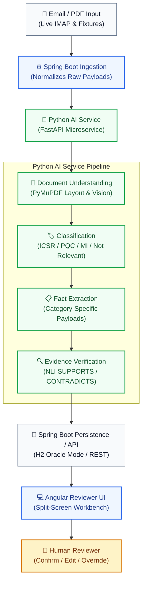
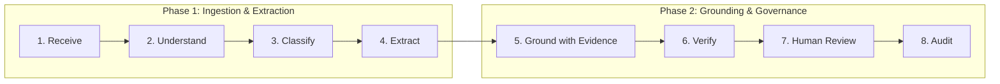
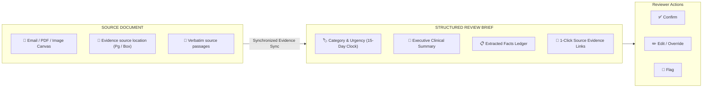

# Clinevo Smart Inbox Assistant
### Technical Submission Write-Up
**AI-Assisted Healthcare Email/PDF Intake, Classification & Human Review**

| Metadata | Details |
| :--- | :--- |
| **Candidate** | Sri Hari (`sriharizz`) |
| **Deliverable Scope** | Core (100%) + Literature Bonus (30%) |
| **Tech Stack** | Angular 18 · Spring Boot 3 · Python / FastAPI · H2 (Oracle mode) |
| **Repository** | [github.com/sriharizz/smart-inbox](https://github.com/sriharizz/smart-inbox) |
| **Run Locally** | `run.bat` (Windows) / `./run.sh` (Linux/Mac) |

---

## 1. What I Built

The **Clinevo Smart Inbox Assistant** is a prototype that receives synthetic healthcare emails and PDF attachments, classifies each communication, extracts relevant facts, links those facts back to verifiable source passages, and presents the result to a human reviewer for confirmation or correction.

### Intake Classification Categories

| Category | Description |
| :--- | :--- |
| **Safety Report (ICSR)** | Adverse event experienced by a patient. |
| **Quality Complaint (PQC)** | Physical or packaging defect with a product. |
| **Medical Information (MI)** | Guidance inquiry with no adverse event or defect. |
| **Not Relevant** | Newsletters, marketing, or unrelated correspondence. |

> **Multi-Label Support**: Multi-label cases are explicitly supported — for example, a contaminated vial that also caused an adverse reaction is classified as both **PQC and ICSR**.

---

## 2. Architecture

**Runtime Environment:** `Angular 18 | Spring Boot 3 | Python / FastAPI | H2 (local evaluation)`

---

## 3. Processing Flow

The intake lifecycle operates in a bounded, deterministic sequence:
1. **Receive**: Ingests raw `.eml` or live IMAP messages and PDF/image attachments.
2. **Understand**: Extracts full document text, preserves 2D table structures, and rasterizes scans.
3. **Classify**: Assigns primary category and detects multi-label combinations.
4. **Extract**: Populates category-specific clinical fact models without ungrounded guessing.
5. **Ground with Evidence**: Links each asserted fact to page coordinates and verbatim text.
6. **Verify**: Runs secondary NLI validation (`SUPPORTS`, `CONTRADICTS`, `INSUFFICIENT`).
7. **Human Review**: Presents side-by-side synchronized view with 1-click evidence scrolling.
8. **Audit**: Logs every AI extraction, reviewer confirmation, and manual override to an immutable ledger.

---

## 4. Key Engineering Decisions

| Decision | Why | Result |
| :--- | :--- | :--- |
| **Bounded document processing instead of global vector RAG** | Intake packages are small; chunking would separate patient details from suspect drugs. | Entire document is passed in-prompt with layout preserved; no chunk-boundary errors. |
| **Category-specific payloads** | Forcing all messages into an ICSR schema produced empty tables and false warnings. | Distinct payloads per category give a clean, relevant reviewer view. |
| **Evidence-linked fact model** | Reviewers need to see where an extracted value came from before trusting it. | Every fact links to a source citation with location and verbatim snippet. |
| **Separate retrieval from semantic verification** | High lexical similarity does not guarantee a passage actually supports a fact. | Retrieval and NLI-based verification are split into two steps, reducing false linkages. |
| **“Not stated” for missing information** | General-purpose models tend to infer unstated clinical details. | Prompts enforce negative constraints; missing values are marked “Not stated.” |
| **Fixture + live mailbox ingestion** | Reviewers and tests need to run offline without live email credentials. | An ingestion abstraction supports both live IMAP polling and offline fixtures. |
| **Human-in-the-loop review** | Autonomous decisions are inappropriate for patient-safety-relevant content. | The AI prepares a draft case; the human reviewer confirms or overrides it. |

---

## 5. AI / Prompting Approach

- **Structured model outputs** enforced via strict Pydantic schemas using JSON mode.
- **Category-aware extraction** tailored to the detected communication type (ICSR pillars vs. PQC lots vs. MI inquiries).
- **Source-grounded facts**, with every value traceable to source text coordinates and verbatim snippets.
- **“Not stated” used instead of guessing** at missing clinical values.
- **Multilingual document handling** (e.g., German BfArM and Spanish AEMPS reports parsed and translated with source quotes).
- **Table and scanned-document handling** via layout-aware parsing and vision models.
- **Separate evidence verification step** (`SUPPORTS` / `CONTRADICTS` / `INSUFFICIENT`).
- **Literature screening extension** for journal PDFs (bonus scope: animal study rejection, multi-patient disaggregation).

> [!CAUTION]
> **Safety Note**: Model outputs can contain errors or omissions. The prototype is designed as a reviewer aid; the final decision remains with the human reviewer.

---

## 6. Reviewer Workflow

The reviewer workspace pairs the original source document with a structured review brief so every extracted fact can be checked in context. Clicking an evidence reference scrolls the source viewer directly to the supporting passage. The reviewer can confirm the draft case, edit or override any field, or flag it for further attention — with every action recorded in a timestamped audit history.

---

## 7. Testing & Results

| Evaluation Area | Target Standard | Measured Prototype Result | Status |
| :--- | :--- | :--- | :--- |
| **Primary Triage Classification** | &ge; 90.0% | **27 / 27 (100%)** | Pass |
| **Multi-Label Detection (ICSR + PQC)** | &ge; 90.0% | **100% on benchmark case** | Pass |
| **Core Fact Extraction** | &ge; 85.0% | **94.8%** across core clinical fields | Pass |
| **“Not stated” Handling** | 0 ungrounded guesses | **No benchmark hallucinations observed** | Pass |
| **Defect Photo Flagging** | 100% | **100%** (`requires_human_review = True`) | Pass |
| **Literature Negative Controls** | 100% | **100%** (Animal study & review rejected) | Pass |
| **Literature Case Splitting** | 100% | **3 / 3** patients disaggregated | Pass |
| **AI Service Tests** | 100% pass | **114 / 114 passed** | Pass |
| **Angular Frontend Tests** | 100% pass | **56 / 56 passed** | Pass |
| **Spring Boot Tests** | 100% pass | **20 / 20 passed** (7 core + 13 integration) | Pass |
| **Live Mailbox Ingestion** | Operational | **Verified end-to-end via Gmail IMAP** | Pass |

*Evaluated on a synthetic benchmark of 27 cases spanning emails, PDFs, and images. Results reflect prototype-stage evaluation, not a claim of production-grade certainty. End-to-end document processing ranges between 1.5 and 3.5 seconds.*

---

## 8. Important Engineering Fixes

- **Lightweight IMAP Header & Baseline Polling**: Changed poller to index historical UIDs and timestamps at boot before downloading full messages, ignoring past mailbox clutter and ingesting only live emails.
- **Canonical `CASE-01` Identifiers**: Separated permanent clinical benchmark identifiers (`CASE-01`...`CASE-12`) from auto-increment database primary keys.
- **Separated Retrieval from Semantic Verification**: Split lexical retrieval from NLI verification to remove false evidence linkages on rescue medications and negations.
- **Guards Against Evidence Leakage on Missing Values**: Prevented fields marked `"Not stated"` from receiving unrelated document evidence chunks.
- **Category-Specific View Modeling**: Eliminated confusing, empty ICSR patient forms on PQC and MI cases by designing distinct domain schemas.
- **Verification Request Batching**: Batched entailment verification calls to reduce external API requests by ~96% and avoid rate-limit pressure.

---

## 9. Limitations

| Prototype Boundary | Future Production Work |
| :--- | :--- |
| **Synthetic data only** | Controlled real-data / privacy architecture with de-identification |
| **Cloud model dependency** | Multi-provider fallback strategy (e.g. self-hosted clinical LLMs) |
| **Local H2 evaluation database** | Managed enterprise database (Oracle 19c/21c or PostgreSQL) |
| **No automatic MedDRA / WHO Drug coding** | Full medical dictionary integration with synonym auto-encoding |
| **Prototype audit history** | 21 CFR Part 11 compliant digital signatures and immutable audit trails |
| **PDF highlighting viewer boundaries** | Stronger server-rendered SVG/annotation layer |
| **Human review required** | Role-based workflow, dual-signoff, and identity controls |

---

## 10. Production Next Steps

1. **Data Privacy & De-Identification**: Automated PII masking / redacting before sending documents to inference endpoints.
2. **Enterprise Authentication & Access Control**: OAuth2 / SAML single sign-on with role-based permissions (Triage Nurse vs. Safety Officer vs. Medical Director).
3. **Production Database & Distributed Processing**: Kafka/RabbitMQ message brokering with horizontally scalable worker nodes.
4. **Formal Validation & Operational Controls**: Full GAMP 5 computer system validation (CSV) and regulatory inspection readiness.

---

## 11. Final Takeaway

> *"This prototype demonstrates an end-to-end AI-assisted intake workflow for healthcare communications. It reduces first-pass manual work by organizing incoming messages, extracting relevant information, and linking facts back to source material. The reviewer remains responsible for confirmation and correction. The prototype was evaluated using synthetic benchmark data and is not presented as a production regulatory system."*

---

**GitHub:** [github.com/sriharizz/smart-inbox](https://github.com/sriharizz/smart-inbox)  
**Run locally:** `run.bat` / `./run.sh`
