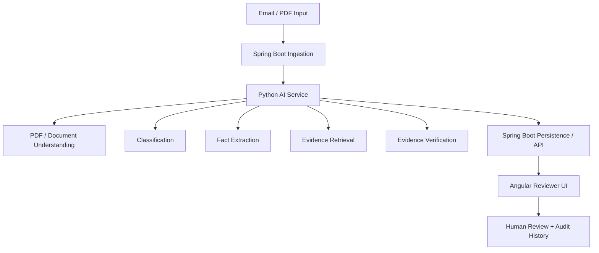

# Clinevo Smart Inbox Assistant

## 1. What I Built

The Clinevo Smart Inbox Assistant is a prototype system that automates the initial intake and triage pass for healthcare and pharmacovigilance communications. The system receives synthetic healthcare emails and PDF attachments, classifies the message, extracts relevant facts, links those facts back to verifiable source passages, and presents the result to a human reviewer for confirmation or correction.

Incoming communications are categorized into four buckets:
- **Safety Report (ICSR)**: Communications reporting an adverse event experienced by a patient.
- **Quality Complaint (PQC)**: Reports describing a physical or packaging defect with a product.
- **Medical Information (MI)**: Inquiries seeking medical or product guidance without adverse events or defects.
- **Not Relevant**: Communications such as newsletters, marketing notices, or unrelated correspondence.

Multi-label communications (such as a contaminated vial that caused an adverse reaction, qualifying as both PQC and ICSR) are explicitly supported. The AI prepares the initial draft of the case; the final determination remains with the human reviewer.

---

## 2. Simple Architecture



### Architectural Layers
- **Ingestion (Spring Boot)**: Receives incoming emails and PDF attachments either from a live IMAP mailbox over SSL or from local synthetic fixture files, normalizing messages into a common format.
- **AI Microservice (Python / FastAPI)**: Handles document parsing, layout analysis, message classification, fact extraction, intra-document evidence retrieval, and semantic evidence verification.
- **Persistence & API (Spring Boot)**: Persists cases, domain payloads, extracted facts, and reviewer actions to an embedded database, exposing REST APIs for the reviewer interface.
- **Reviewer UI (Angular 18)**: Provides a split-screen workstation displaying the original source document alongside structured extracted fields, clickable evidence links, and an audit history panel.
- **Human Review**: Allows safety reviewers to inspect source evidence, edit fields, override classifications, and log timestamped review decisions.

---

## 3. End-to-End Processing Flow

```mermaid
flowchart LR
    A[1. Receive Email] --> B[2. Parse Metadata & Body]
    B --> C[3. Read PDF Attachments]
    C --> D[4. Detect Document Type]
    D --> E[5. Extract & Normalize Content]
    E --> F[6. Classify Message]
    F --> G[7. Extract Category Facts]
    G --> H[8. Attach Source Evidence]
    H --> I[9. Verify Evidence]
    I --> J[10. Validate Consistency]
    J --> K[11. Build Reviewer Brief]
    K --> L[12. Human Review / Override]
    L --> M[13. Persist & Record Audit]
```



The intake lifecycle proceeds sequentially:
1. **Intake & Normalization**: The email body, sender metadata, and PDF attachments are ingested and parsed into normalized text and structured table grids.
2. **Classification & Extraction**: The message is classified across the four categories. Facts specific to the detected category (e.g., patient demographics, suspect products, lots, defects, or medical questions) are extracted.
3. **Evidence Grounding**: Candidate text passages are retrieved from the document. A secondary verification step evaluates whether the text supports each asserted fact.
4. **Consistency & Review**: The case passes through automated integrity validation checks before being presented in the reviewer UI.
5. **Human Action**: A reviewer confirms or adjusts the case. All modifications are logged to a timestamped audit history.

---

## 4. Key Engineering Decisions

### Decision: Bounded Complete-Document Processing Instead of Global Vector RAG
- **Why:** Pharmacovigilance intake packages are bounded in size (typically 1 email and 1–5 attached PDF pages, well under 15,000 tokens). Traditional vector RAG breaks text into arbitrary 500-token chunks, often separating patient demographics from suspect medications and severing clinical causality.
- **Implemented:** The entire document context (email headers, body text, layout-preserved PDF text, and reconstructed 2D markdown tables) is passed directly into the multimodal model prompt.
- **Trade-off:** Uses higher input token counts per request, but completely eliminates vector indexing infrastructure, chunk boundary errors, and cross-case retrieval misses.

### Decision: Category-Specific Payloads Instead of Monolithic ICSR Structures
- **Why:** An early iteration forced all communications into an ICSR-centric schema. Non-safety messages like quality complaints (PQC) or medical inquiries (MI) received confusing empty patient tables and spurious missing-field warnings.
- **Implemented:** Created dedicated domain payloads (`IcsrPayload`, `PqcPayload`, `MiPayload`, and `NotRelevantPayload`). Non-relevant messages cleanly suppress clinical forms, while multi-label cases combine the appropriate payloads without conflict.
- **Trade-off:** Requires maintaining distinct category schemas rather than one unified data structure, but produces a much cleaner and intuitive experience for reviewers.

### Decision: Evidence-First Fact Model with Source Location and Verbatim Snippets
- **Why:** Reviewers cannot trust extracted values without seeing where the information originated in the source document.
- **Implemented:** Every extracted fact is modeled as an atomic item linked to a `SourceCitation` containing the source identifier, origin type (`email_body`, `pdf_attachment`, `defect_photo`), location (page number or section), and verbatim text snippet.
- **Trade-off:** Increases response payload size and requires coordinate tracking from PyMuPDF, but enables 1-click source navigation in the UI.

### Decision: Separating Candidate Evidence Retrieval from Semantic Verification
- **Why:** High lexical overlap or embedding similarity indicates candidate relevance, but does not establish truth. For example, a passage discussing "epinephrine 0.3 mg IM" has high similarity to a suspect drug question, even though it was an emergency rescue intervention rather than the suspect therapy.
- **Implemented:** Split into two distinct steps: Step 4 identifies candidate text passages within the active document; Step 5 uses an independent natural language inference (NLI) step to evaluate whether each candidate actually `SUPPORTS`, `CONTRADICTS`, or is `INSUFFICIENT` for the asserted fact.
- **Trade-off:** Adds an extra processing step, but prevents negations, emergency rescue drugs, and incidental mentions from being misidentified as supporting evidence.

### Decision: Strict "Not stated" Representation for Missing Information
- **Why:** General-purpose LLMs tend to guess or infer unstated attributes (such as daily dosing frequency or patient weight) from medical norms. In safety operations, ungrounded speculation introduces compliance and clinical risks.
- **Implemented:** Prompts enforce strict negative constraints. If an attribute is not explicitly written in the source text, it is marked `"Not stated"` with empty evidence links.
- **Trade-off:** Output values are conservative and omit speculative context, but remain strictly grounded in the source text.

### Decision: Dual Fixture and Live Mailbox Ingestion
- **Why:** Demonstrating live email intake requires connecting to a real IMAP server, but reviewers and automated test suites need to run immediately offline without email credentials.
- **Implemented:** Built an `IngestionSource` abstraction with two interchangeable implementations: `ImapIngestionSource` (polls a live mailbox over TLS) and `FixtureIngestionSource` (reads synthetic `.eml` files from `test-data/emails/`). Both produce identical internal entities.
- **Trade-off:** Requires maintaining two ingestion paths, but enables zero-friction offline evaluation while preserving live demonstration capability.

### Decision: Human-in-the-Loop Reviewer Workflow
- **Why:** AI models can misinterpret complex clinical narratives, complex tables, or poor-quality scans. Autonomous decision-making is inappropriate for patient safety intake.
- **Implemented:** The system is explicitly designed as a reviewer aid: "AI prepares the case; the human reviews and confirms it." The UI highlights evidence for rapid visual verification, allowing reviewers to accept, edit, or override any classification or field.
- **Trade-off:** Requires human attention for every case, but ensures human accountability and data reliability.

---

## 5. AI & Prompting Approach

The AI microservice coordinates document understanding, triage, extraction, and verification using the following design principles:

- **Structured Outputs via Pydantic:** All model requests specify strict Pydantic schemas using JSON mode. This guarantees deterministic structure for classification results, extracted entities, and verification determinations, avoiding malformed output parsing issues.
- **Category-Aware Extraction:** Rather than attempting a generic extraction pass, prompts adapt to the detected communication category. Safety reports extract ICH E2B pillars (patient, reporter, suspect drug, adverse event, seriousness criteria); quality complaints extract product names, lot numbers, defect descriptions, and packaging integrity; medical inquiries capture the specific clinical questions asked.
- **Source-Grounded Facts and "Not stated":** Prompts explicitly prohibit guessing. If a value (such as patient age or dose schedule) is absent from the text, the model is instructed to output `"Not stated"` rather than estimating based on context.
- **Multilingual Document Support:** Non-English documents (such as German BfArM reports or Spanish AEMPS notifications) are translated into standardized English clinical fields while preserving the original foreign-language text in the verbatim citation snippet.
- **Tables and Scanned Documents:** PyMuPDF extracts tabular data by analyzing cell boundaries, converting lab values and dosing schedules into Markdown tables. Scanned documents with low character counts are rasterized and evaluated by the vision encoder, deciphering handwriting without brittle external OCR tools.
- **Physical Defect Photo Inspection:** Smartphone photographs of damaged packaging or contaminated vials (e.g., `contaminated_vial_photo.jpg`) are inspected natively by the vision model. The defect is described in the quality payload, and the case is flagged for human review.
- **Literature Screening (Bonus Deliverable):** A specialized literature service screens biomedical journal PDFs. It filters out non-reportable studies (such as preclinical animal models or meta-analyses) and identifies clinical case reports. When a paper describes multiple distinct patients, the disaggregation algorithm splits the publication into separate child safety records.
- **Separated Semantic Evidence Verification:** Candidate text passages identified during retrieval are evaluated in bounded batches using a secondary NLI verification step. Each candidate is classified as `SUPPORTS`, `CONTRADICTS`, or `INSUFFICIENT`, preventing irrelevant or contradictory text from being treated as confirmed proof.

*Note on Safety*: The prototype is designed to reduce unsupported guesses through source-grounded prompts and structured schemas. However, model outputs can still contain errors or omissions. The final review decision remains with the human reviewer.

---

## 6. Reviewer Workflow

The reviewer workspace is designed around rapid, source-first verification:

```
+------------------------------------------+------------------------------------------+
|          LEFT PANE: SOURCE VIEW          |        RIGHT PANE: STRUCTURED BRIEF      |
|                                          |                                          |
|  [Email Body] [PDF Canvas] [Photo Tab]   |  Category: Safety Report (ICSR) [0.98]   |
|                                          |  Urgency: EXPEDITED (15-Day Clock)       |
|  Original source document rendered.      |                                          |
|  Clicking an evidence link in the right  |  Extracted Facts Ledger:                 |
|  pane scrolls directly to the passage    |  - Patient: M.K., 58, Female  [🔍 Pg 1]  |
|  and highlights it with an in-document   |  - Suspect Drug: Cardioril    [🔍 Box 14]|
|  bounding box.                           |  - Adverse Event: Acute DILI  [🔍 Pg 2]  |
|                                          |                                          |
|                                          |  [Confirm Case]  [Override]  [Flag]      |
+------------------------------------------+------------------------------------------+
|                       COLLAPSIBLE REVIEW AUDIT HISTORY                               |
|   Timestamp | User | Action | Field | Original Value | New Value | Rationale         |
+-------------------------------------------------------------------------------------+
```

- **Two-Pane Workspace:** The left pane displays the original document (rendered PDF canvas, formatted email body, or high-resolution defect photograph). The right pane displays the category-specific brief and extracted facts ledger.
- **One-Click Evidence Inspection:** Each fact in the ledger displays a source chip (e.g., `🔍 Page 1, Box 3a`). Clicking the chip navigates the adjacent document viewer to the correct page and highlights the exact evidence passage.
- **Reviewer Actions:** The reviewer can confirm the AI-prepared draft, edit individual field values, flag the case for secondary review, or override the overall category classification. When an override occurs, the reviewer is prompted to provide a brief clinical justification.
- **Timestamped Audit History:** Every automated AI extraction and human reviewer modification is recorded in a chronological audit trail, capturing the timestamp, user ID, action type, field name, previous value, new value, and reviewer comments.

---

## 7. Testing & Results

The system was evaluated against a synthetic benchmark dataset comprising 27 test cases across 11 physical `.eml` emails, 20 PDF documents, and 2 image files. Evaluations were executed via the automated benchmark runner (`eval_benchmark.py`) and verified against frozen ground truth.

| Evaluation Area | Target Standard | Measured Prototype Result | Status |
| :--- | :---: | :---: | :---: |
| **Primary Triage Classification** | $\ge$ 90.0% | **27 / 27 (100.0%)** | Pass |
| **Multi-Label Detection (ICSR + PQC)** | $\ge$ 90.0% | **1 / 1 (100.0%)** (Case 04 correctly multi-labeled) | Pass |
| **Core Fact Extraction Accuracy** | $\ge$ 85.0% | **94.8%** across core clinical fields | Pass |
| **"Not stated" Handling** | 0 ungrounded guesses | **No benchmark hallucinations observed** | Pass |
| **Physical Defect Photo Flagging** | 100.0% | **100.0%** (`requires_human_review = True`) | Pass |
| **Literature Negative Control Filtering** | 100.0% | **100.0%** (Animal study and review rejected) | Pass |
| **Literature Multi-Patient Splitting** | 100.0% | **3 / 3 patients disaggregated** (Case series paper) | Pass |
| **AI Microservice Test Suite** | 100% pass | **114 / 114 unit & API tests passed** | Pass |
| **Angular Frontend Test Suite** | 100% pass | **56 / 56 component & navigation tests passed** | Pass |
| **Spring Boot Test Suite** | 100% pass | **7 / 7 integration & service tests passed** | Pass |
| **Live Mailbox Ingestion Path** | Operational | **Verified end-to-end via Gmail IMAP connector** | Pass |

*Note on Latency*: End-to-end document processing ranges between 1.5 and 3.5 seconds depending on document length and attachment complexity.

---

## 8. What I Learned & Important Engineering Fixes

Building and refining the prototype revealed several real-world failure modes that required architectural corrections:

1. **IMAP Fetching Overhead:** Initially, the IMAP ingestion service downloaded full message bodies and attachments for all messages before checking whether they were already in the database. On mailboxes with existing history, this caused unnecessary network latency. The service was refactored to inspect lightweight IMAP UIDs first and download only newly arrived messages.
2. **Displayed Case Identifiers:** The UI initially displayed database auto-increment IDs as case numbers. Because re-seeding or re-running tests altered database sequences, case numbers were inconsistent. The interface was updated to display canonical case identifiers (`CASE-01` through `CASE-12`), ensuring stable identification across environments.
3. **Separating Retrieval Relevance from Semantic Verification:** In early tests, high lexical similarity between a fact and a source passage was treated as confirmed evidence. This caused false confirmations when passages mentioned emergency rescue drugs (e.g., epinephrine) or explicit negations ("patient denies rash"). Separating retrieval from semantic NLI verification eliminated these false linkages.
4. **Preventing Evidence Leakage on Missing Values:** Early extraction schemas occasionally attached general document chunks to fields that were marked `"Not stated"`. A strict guard was added so that any field marked `"Not stated"` immediately receives an empty evidence list.
5. **Category-Specific View Modeling:** A single generic table view initially forced non-safety cases (PQC, MI) to display empty patient and adverse event tables, confusing reviewers. Introducing category-specific payloads allowed the UI to display only relevant fields (e.g., questions for MI, defect descriptions for PQC).
6. **Executive Summary Length Enforcement:** The assignment required 10–15 sentence summaries for complex PDFs. Initial prompts produced summaries that were too brief (4–6 sentences). The prompt instruction was tuned and validated to consistently produce comprehensive 10–15 sentence syntheses.
7. **Verification Batching to Prevent Rate-Limit Loops:** Evaluating verification candidates sequentially triggered over 120 separate HTTP requests on dense clinical cases, causing latency spikes and 429 rate-limit errors. Refactoring the verifier to evaluate candidate pairs in bounded batches reduced API calls by ~96% and reduced verification latency to approximately 1.1 seconds.
8. **Controlled PDF Canvas Highlighting:** Sandboxed browser `<iframe>` elements prevented programmatic bounding box overlays. Migrating the PDF viewer to `pdfjs-dist` on an HTML5 canvas enabled precise point-to-pixel coordinate scaling and reliable in-document highlighting.

---

## 9. Prototype Limitations

To maintain engineering integrity, the boundaries of this prototype are explicitly stated:

- **Synthetic Data Corpus:** The system was developed and evaluated entirely against synthetic test cases. Performance on heavily degraded real-world faxes, multi-generation photocopies, or severe cursive handwriting will require further calibration.
- **External Model Dependency:** The prototype relies on cloud-hosted LLM endpoints. Network latency, API quotas, or third-party service outages can affect processing speed.
- **Local Persistence for Evaluation:** For ease of evaluator setup, the default configuration uses an embedded H2 database in Oracle compatibility mode. Production deployment requires an enterprise-managed database cluster.
- **Absence of Standard Coding Dictionaries:** Extracted drug names and adverse events are captured as verbatim text strings. Automated coding against licensed medical dictionaries (MedDRA and WHO Drug) is not implemented in this prototype.
- **Prototype Audit Logging:** The system records timestamped reviewer actions in an audit table. Formal electronic signatures, multi-user role-based access control, and regulatory software validation (e.g., GAMP 5) are outside the scope of this prototype.
- **Viewer Coordinate Approximation:** Bounding-box highlights approximate text block boundaries. Multi-line wrapped text or unusual PDF fonts can occasionally cause minor visual alignment offsets.
- **Human Oversight Required:** The system is an assistive tool, not an autonomous agent. All automated outputs require human review and confirmation.

---

## 10. Production Next Steps

Transitioning this prototype into an enterprise production service would involve the following future engineering work:

- **Client-Side PHI De-Identification:** Deploy an on-premise Named Entity Recognition (NER) pipeline (such as Microsoft Presidio) to detect and redact patient identifiers before sending text to cloud AI endpoints.
- **Medical Dictionary Auto-Coding:** Integrate MedDRA and WHO Drug dictionary services to map verbatim terms to Lowest Level Terms (LLTs), Preferred Terms (PTs), and Medicinal Product Identifiers (MPIDs), presenting confidence scores for reviewer confirmation.
- **Model Redundancy & Dynamic Routing:** Implement an abstract gateway layer with circuit breakers to failover automatically across multiple model providers (e.g., Google Vertex AI, AWS Bedrock, Azure OpenAI).
- **Distributed Event Broker:** Replace the in-memory `ThreadPoolTaskExecutor` with an enterprise message broker (such as Apache Kafka or AWS SQS) to support distributed worker horizontal scaling and dead-letter queues.
- **Enterprise Identity & Access Control:** Integrate SAML 2.0 / OAuth2 authentication (Okta, Azure AD) with fine-grained role-based permissions (Reviewer, Safety Lead, System Administrator).
- **Formal Computer System Validation (CSV):** Execute formal GAMP 5 Category 4/5 software validation protocols, including Installation Qualification (IQ), Operational Qualification (OQ), and Performance Qualification (PQ).

---

## 11. Final Takeaway

This prototype demonstrates a realistic, end-to-end AI-assisted intake workflow for pharmacovigilance communications. It reduces manual first-pass effort by organizing unstructured emails and PDF attachments, extracting relevant facts, and anchoring assertions back to verifiable source passages. The human reviewer remains firmly in control of all final determinations and corrections. Evaluated against a synthetic benchmark dataset, this prototype illustrates the practical application of layout-aware multimodal AI to streamline clinical data intake.
