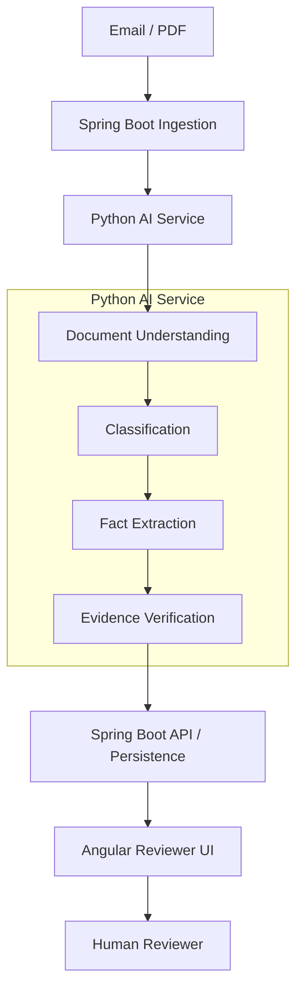
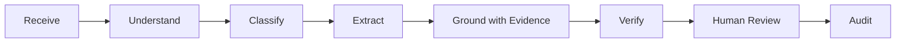
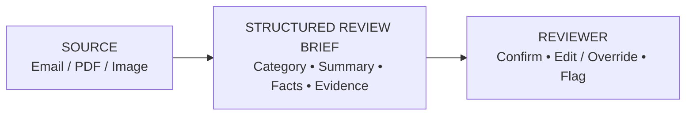

# Clinevo Smart Inbox Assistant
### Technical Submission Write-Up
**AI-Assisted Healthcare Email/PDF Intake, Classification & Human Review**

| Metadata | Details |
| :--- | :--- |
| **Candidate** | Sri Hari |
| **Deliverable Scope** | Core Intake (100%) + Literature Screening Bonus |
| **Tech Stack** | Angular 18 · Spring Boot 3 · Python / FastAPI · H2 (local evaluation) |
| **Repository** | [github.com/sriharizz/smart-inbox](https://github.com/sriharizz/smart-inbox) |
| **Run Locally** | `run.bat` (Windows) / `./run.sh` (Linux/Mac) |

---

## 1. What I Built

The **Clinevo Smart Inbox Assistant** is a prototype that receives synthetic healthcare emails and PDF attachments, classifies each communication, extracts relevant facts, links those facts back to verifiable source passages, and presents the result to a human reviewer for confirmation or correction.

### Intake Classification Categories

| Category | Description |
| :--- | :--- |
| **Safety Report (ICSR)** | Adverse event experienced by a patient. |
| **Quality Complaint (PQC)** | Physical or packaging defect with a product. |
| **Medical Information (MI)** | Guidance inquiry with no adverse event or defect. |
| **Not Relevant** | Newsletters, marketing, or unrelated correspondence. |

Multi-label cases are explicitly supported — for example, a contaminated vial that also caused an adverse reaction is classified as both **PQC and ICSR**.

---

## 2. Architecture

---

## 3. Processing Flow

The intake lifecycle operates in a bounded, deterministic sequence:
1. **Receive**: Ingests incoming emails and PDF/image attachments.
2. **Understand**: Extracts document text, preserves table structures, and processes scans.
3. **Classify**: Determines primary category and detects multi-label combinations.
4. **Extract**: Populates category-specific clinical fact models without ungrounded guessing.
5. **Ground with Evidence**: Links extracted facts to verifiable source passages where available.
6. **Verify**: Runs two-stage verification to confirm whether passages support asserted facts.
7. **Human Review**: Presents side-by-side synchronized view with source evidence navigation.
8. **Audit**: Records all AI extractions and reviewer actions in a timestamped audit history.

---

## 4. Key Engineering Decisions

| Decision | Why | Result |
| :--- | :--- | :--- |
| **Bounded document processing instead of global vector RAG** | Intake packages are small; chunking would separate patient details from suspect drugs. | Entire document is passed in-prompt with layout preserved; avoids document fragmentation caused by arbitrary chunk boundaries. |
| **Category-specific payloads** | Forcing all messages into an ICSR schema produced empty tables and false warnings. | Distinct payloads per category give a clean, relevant reviewer view and reduce schema confusion. |
| **Evidence-linked fact model** | Reviewers need to see where an extracted value came from before trusting it. | Extracted facts include source citations where available, providing location and verbatim snippet. |
| **Separate retrieval from semantic verification** | High lexical similarity does not guarantee a passage actually supports a fact. | Retrieval and NLI-based verification are split into two steps; reduced false evidence linkages observed in earlier iterations. |
| **“Not stated” for missing information** | General-purpose models tend to infer unstated clinical details. | Prompts enforce negative constraints; missing values are marked “Not stated” instead of guessing. |
| **Fixture + live mailbox ingestion** | Reviewers and tests need to run offline without live email credentials. | An ingestion abstraction supports both live IMAP polling and offline fixtures. |
| **Human-in-the-loop review** | Autonomous decisions are inappropriate for patient-safety-relevant content. | Human review remains required because model outputs can contain errors or omissions. The AI prepares a draft case; the human reviewer confirms or overrides it. |

---

## 5. AI / Prompting Approach

- **Structured outputs:** Enforced via structured schemas to reduce output parsing issues.
- **Category-aware extraction:** Tailored to the detected communication type (ICSR, PQC, or MI).
- **Source-grounded facts:** Extracted facts include source citations where available.
- **“Not stated” for missing info:** Negative constraints avoid guessing when data is absent.
- **Multilingual handling:** Handles non-English communications (e.g. German, Spanish).
- **Tables / scanned documents:** Layout-aware parsing and vision models handle complex documents.
- **Separate evidence verification:** Two-stage verification checks passage support (SUPPORTS / CONTRADICTS).
- **Literature screening bonus:** Screens journal PDFs, rejecting negative controls and splitting multi-patient cases.

> **Safety note:** Model outputs can contain errors or omissions. The prototype is designed as a reviewer aid; the final decision remains with the human reviewer.

---

## 6. Reviewer Workflow

The reviewer workspace pairs the source document with a structured review brief so extracted facts can be verified in context. Clicking an evidence reference navigates to the relevant source region and provides document-level evidence highlighting where supported. The reviewer can confirm the draft case, edit or override any field, or flag it for further attention. Reviewer actions are recorded in the timestamped audit history.

---

## 7. Testing & Results

| Evaluation Area | Measured Prototype Result |
| :--- | :--- |
| Primary triage classification | **27 / 27 (100%)** |
| Multi-label detection | **100% on benchmark case** |
| Core fact extraction | **94.8%** |
| “Not stated” handling | **No benchmark hallucinations observed** |
| Defect photo flagging | **100%** |
| Literature negative controls | **100%** |
| Literature case splitting | **3 / 3** |
| AI service tests | **114 / 114 passed** |
| Angular tests | **56 / 56 passed** |
| Spring Boot tests | **20 / 20 passed** (7 core + 13 integration) |
| Live mailbox ingestion | **Verified end-to-end** |

*Evaluated on a synthetic benchmark of 27 cases spanning emails, PDFs, and images. Results reflect prototype-stage evaluation, not a claim of production-grade certainty.*

---

## 8. Important Engineering Fixes

- **IMAP Fetching Optimization:** Ingestion was optimized to index baseline UIDs and timestamps at startup, ignoring past mailbox clutter and ingesting only live emails.
- **Canonical Case Identifiers:** Stable canonical case identifiers (CASE-01 through CASE-12) were decoupled from database auto-increment keys.
- **Retrieval vs. Semantic Verification Separation:** Lexical retrieval and semantic NLI verification were separated into distinct stages; reduced false evidence linkages observed in earlier iterations.
- **Missing-Value Evidence Isolation:** Fields marked “Not stated” were isolated so they do not receive unrelated document text passages as evidence.
- **Category-Specific Schemas:** Distinct payloads were designed per category, reducing output parsing issues through structured schemas and removing irrelevant fields.
- **Verification Batching:** Fact verification requests were batched; reduced unnecessary API calls and rate-limit pressure.
- **PDF Viewer / Highlighting Improvement:** Coordinate-based document navigation was enhanced to direct reviewers to relevant source regions where supported.

---

## 9. Limitations

| Prototype Boundary | Future Production Work |
| :--- | :--- |
| Synthetic data only | Controlled real-data / privacy architecture |
| Cloud model dependency | Multi-provider fallback strategy |
| Local H2 evaluation database | Managed enterprise database |
| No automatic MedDRA / WHO Drug coding | Dictionary integration |
| Prototype audit history | Formal validation and operational controls |
| PDF viewer limitations | Document rendering / annotation layer improvements |
| Human review required | Workflow / identity controls for production |

---

## 10. Production Next Steps

- Data privacy and de-identification
- Enterprise authentication and access control
- Production database and distributed processing
- Formal validation and operational controls

---

## 11. Final Takeaway

> *"This prototype demonstrates an end-to-end AI-assisted intake workflow for healthcare communications. It reduces first-pass manual work by organizing incoming messages, extracting relevant information, and linking facts back to source material. The reviewer remains responsible for confirmation and correction. The prototype was evaluated using synthetic benchmark data and is not presented as a production regulatory system."*

---

**GitHub:** [https://github.com/sriharizz/smart-inbox](https://github.com/sriharizz/smart-inbox)  
**Run locally:** `run.bat` / `./run.sh`
