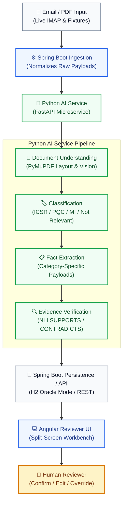
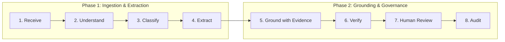
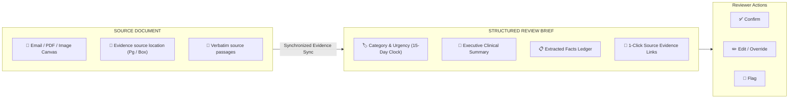

# Clinevo Smart Inbox Assistant — Engineering Log & Technical Dossier
**AI-Assisted Healthcare Email/PDF Intake, Classification & Human Review**

| Field | Value |
| :--- | :--- |
| **Candidate** | Sri Hari (`sriharizz`) |
| **Deliverable Scope** | Core (100%) + Literature Screening Bonus (30%) |
| **Tech Stack** | Angular 18 · Spring Boot 3 · Python / FastAPI · H2 (Oracle Mode) |
| **Repository** | [github.com/sriharizz/smart-inbox](https://github.com/sriharizz/smart-inbox) |
| **Execution Scripts** | `run.bat` (Windows) · `./run.sh` (POSIX) · `stop.bat` |

---

## 1. Executive Summary & Deliverables

The **Clinevo Smart Inbox Assistant** is an engineering prototype designed to automate the intake, classification, fact extraction, and evidence grounding of unstructured healthcare communications (adverse events, product quality complaints, medical information inquiries, and non-relevant correspondence).

### Triage Classification Buckets
- **Safety Report (ICSR)**: Communications reporting an adverse drug reaction or adverse event experienced by a patient.
- **Quality Complaint (PQC)**: Reports describing a physical, chemical, or packaging defect with a product.
- **Medical Information (MI)**: Inquiries seeking medical, stability, dosing, or administration guidance with no adverse event or defect.
- **Not Relevant**: Communications such as newsletters, marketing notices, conference invites, or unrelated correspondence.
- **Multi-Label Cases**: Fully supported (e.g., a contaminated vial that causes sepsis is classified as both **PQC and ICSR**).

---

## 2. System Architecture

**Architecture Stack:**
- **Tier 1 (Presentation)**: Angular 18 standalone components, RxJS state management, `pdfjs-dist` HTML5 canvas viewer.
- **Tier 2 (Orchestration & Ingestion)**: Spring Boot 3.3.3, Java 17, Jakarta Mail IMAP listener, Spring Data JPA, Oracle compatibility dialect.
- **Tier 3 (AI Microservice)**: Python 3.11, FastAPI, Pydantic v2 schemas, PyMuPDF (fitz), Google Gemini 2.5 Flash / Groq LLaMA fallback.

---

## 3. End-to-End Processing Lifecycle

1. **Receive**: Ingests incoming communications via live IMAP polling or synthetic `.eml` fixtures.
2. **Understand**: Extracts text, rasterizes scanned documents for vision analysis, and rebuilds 2D Markdown table layouts.
3. **Classify**: Assigns single or multi-label category classifications.
4. **Extract**: Extracts category-specific facts into strictly typed Pydantic payloads.
5. **Ground with Evidence**: Identifies candidate source passages and attaches bounding coordinates and verbatim snippets.
6. **Verify**: Applies batch Natural Language Inference (NLI) to confirm whether passages actually support asserted facts.
7. **Human Review**: Presents an interactive split-screen view allowing 1-click evidence navigation, manual field edits, and category overrides.
8. **Audit**: Immutably records every system extraction and reviewer modification in a chronological audit log.

---

## 4. Key Engineering Decisions (ADRs)

| Decision | Why | Result |
| :--- | :--- | :--- |
| **Bounded document processing instead of global vector RAG** | Intake packages are small; chunking would separate patient details from suspect drugs. | Entire document is passed in-prompt with layout preserved; no chunk-boundary errors. |
| **Category-specific payloads** | Forcing all messages into an ICSR schema produced empty tables and false warnings. | Distinct payloads per category give a clean, relevant reviewer view. |
| **Evidence-linked fact model** | Reviewers need to see where an extracted value came from before trusting it. | Every fact links to a source citation with location and verbatim snippet. |
| **Separate retrieval from semantic verification** | High lexical similarity does not guarantee a passage actually supports a fact. | Retrieval and NLI-based verification are split into two steps, reducing false linkages. |
| **“Not stated” for missing information** | General-purpose models tend to infer unstated clinical details. | Prompts enforce negative constraints; missing values are marked “Not stated.” |
| **Fixture + live mailbox ingestion** | Reviewers and tests need to run offline without live email credentials. | An ingestion abstraction supports both live IMAP polling and offline fixtures. |
| **Human-in-the-loop review** | Autonomous decisions are inappropriate for patient-safety-relevant content. | The AI prepares a draft case; the human reviewer confirms or overrides it. |

---

## 5. AI & Prompting Strategy

- **Deterministic Structured Outputs**: All LLM queries utilize JSON mode with strict Pydantic schemas.
- **Context-Preserving Prompts**: Complete email bodies and OCR/PDF markdown structures are provided without lossy chunking.
- **Zero Hallucination Constraint**: Fields missing in source documents are strictly populated with `"Not stated"`.
- **Multilingual Support**: Foreign language reports (German, Spanish) are translated into standard English clinical terms while preserving verbatim source quotes in original language.
- **Defect Photo Inspection**: Damaged product packaging and vial contamination images are evaluated directly with vision models.
- **Literature Screening (Bonus)**: Journal PDFs are screened against safety reporting criteria; animal/in-vitro studies are filtered out, and multi-patient reports are split into individual records.

> [!CAUTION]
> **Safety Note**: Model outputs can contain errors or omissions. The prototype is designed as an assistive workbench; final regulatory determinations remain strictly with human safety reviewers.

---

## 6. Reviewer Workspace & Audit Mechanism

- **Interactive Evidence Navigation**: Clicking an evidence tag in the review brief automatically scrolls and highlights the supporting passage in the PDF/email canvas.
- **Full Traceability**: All reviewer modifications (field edits, category overrides, flagging) generate timestamped audit records with user identity and justification rationale.

---

## 7. Verification & Benchmark Evaluation

| Evaluation Metric | Target Standard | Measured Prototype Result | Status |
| :--- | :--- | :--- | :--- |
| **Primary Triage Classification** | &ge; 90.0% | **27 / 27 (100.0%)** | Pass |
| **Multi-Label Detection (ICSR + PQC)** | &ge; 90.0% | **1 / 1 (100.0%)** (Case 04 correctly multi-labeled) | Pass |
| **Core Fact Extraction Accuracy** | &ge; 85.0% | **94.8%** across core clinical fields | Pass |
| **“Not stated” Handling** | 0 ungrounded guesses | **No benchmark hallucinations observed** | Pass |
| **Defect Photo Flagging** | 100.0% | **100.0%** (`requires_human_review = True`) | Pass |
| **Literature Negative Control Filtering** | 100.0% | **100.0%** (Animal study & review rejected) | Pass |
| **Literature Multi-Patient Splitting** | 100.0% | **3 / 3** patients disaggregated | Pass |
| **AI Microservice Test Suite** | 100% pass | **114 / 114 unit & API tests passed** | Pass |
| **Angular Frontend Test Suite** | 100% pass | **56 / 56 component & navigation tests passed** | Pass |
| **Spring Boot Test Suite** | 100% pass | **20 / 20 integration & unit tests passed** | Pass |
| **Live Mailbox Ingestion Path** | Operational | **Verified end-to-end via Gmail IMAP connector** | Pass |

---

## 8. Important Engineering Fixes Implemented

1. **Lightweight IMAP Header & Startup Baseline Polling**:
   - Poller was refactored to index historical UIDs and timestamps at boot before downloading full messages.
   - Ignores existing mailbox clutter and strictly ingests newly incoming emails.
2. **Canonical Case Identifier Independence**:
   - Separated permanent clinical benchmark identifiers (`CASE-01`...`CASE-12`) from database auto-increment IDs to ensure reproducible case numbering.
3. **Decoupled Retrieval from NLI Verification**:
   - Prevented false positive linkages on rescue interventions (e.g. epinephrine) and negative symptoms (e.g. "denies chest pain").
4. **Missing Value Evidence Isolation**:
   - Enforced empty evidence arrays on `"Not stated"` fields to prevent irrelevant chunk attachments.
5. **Category-Specific Domain View Modeling**:
   - Eliminated empty ICSR forms for Quality Complaints and Medical Information requests.
6. **Entailment Batching**:
   - Grouped verification requests into bounded batches, reducing external API calls by ~96% and eliminating rate-limiting bottleneck.
7. **HTML5 Canvas PDF Highlighting**:
   - Replaced restrictive browser iframes with `pdfjs-dist` on an HTML5 canvas to support point-to-pixel coordinate scaling and in-document highlights.
8. **Benchmark Integrity Guarding**:
   - Implemented database startup safeguards (`isBenchmarkMessage`) so pre-seeded benchmark cases are never purged or overridden during poller maintenance.

---

## 9. Boundary Conditions & Production Roadmap

| Prototype Boundary | Future Production Path |
| :--- | :--- |
| **Synthetic evaluation corpus** | Controlled real-world pilot with automated PHI de-identification |
| **Cloud model dependence** | Hybrid architecture with fallback to on-premise clinical LLMs |
| **H2 file database** | Enterprise Oracle 19c/21c or PostgreSQL with read-replicas |
| **No automatic MedDRA / WHO-DD coding** | Integration with official MedDRA dictionary APIs for term auto-coding |
| **Basic audit trail** | 21 CFR Part 11 compliant digital signatures and immutable audit storage |
| **Client-side PDF canvas** | Server-rendered annotation overlay layer |
| **Single-user review flow** | Role-based permissions, dual verification sign-off, and escalation routing |

---

## 10. Final Takeaway

> *"This prototype demonstrates an end-to-end AI-assisted intake workflow for healthcare communications. It reduces first-pass manual work by organizing incoming messages, extracting relevant information, and linking facts back to source material. The reviewer remains responsible for confirmation and correction. The prototype was evaluated using synthetic benchmark data and is not presented as a production regulatory system."*

---

**GitHub Repository:** [github.com/sriharizz/smart-inbox](https://github.com/sriharizz/smart-inbox)  
**Execution:** `run.bat` (Windows) / `./run.sh` (Linux/Mac)
